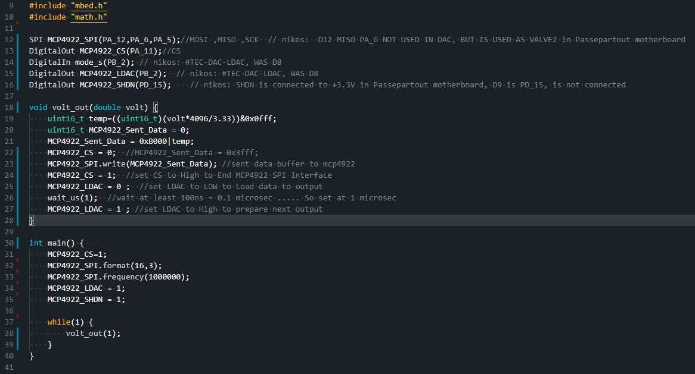

#  [Passepartout_DAC](https://github.com/PASSEPARTOUTmtu/Passepartout_DAC) 

Test program for the MCP4821 DAC

> imported from: https://os.mbed.com/teams/fra221-pb11/code/Lab4MCP492_SPI//file/b81dc534e7d7/main.cpp/

----

## References
 https://www.arduino.cc/reference/en/libraries/mcp_dac/
  * https://github.com/RobTillaart/MCP_DAC
  * https://os.mbed.com/teams/FRA221_2015/code/MCP4922_Sinewave/file/bf75b2a7d8b5/MCP4922.h/
  * https://ww1.microchip.com/downloads/en/DeviceDoc/22244B.pdf
  * https://ww1.microchip.com/downloads/en/devicedoc/22250a.pdf